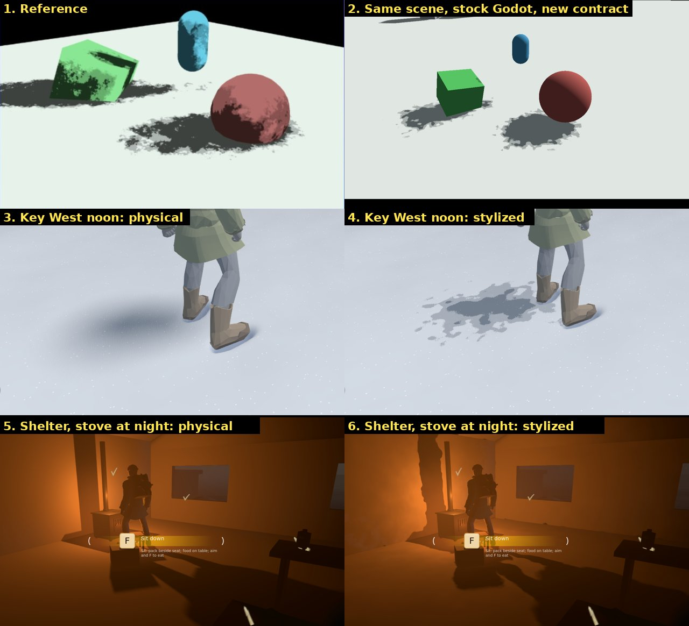
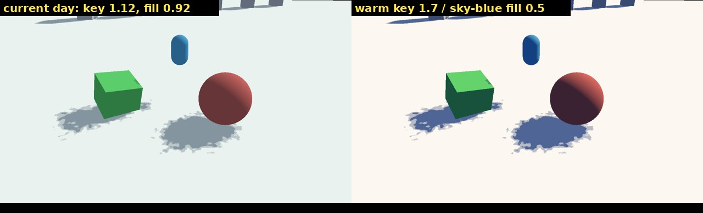

# Light and shadow direction

Status: research input for the author, 2026-10-01. It closes the shadow topic:
what the shipped contract already covers, what artists and the reference games
say is still missing around shadows, and what each gap would cost. Nothing
here is decided until the author marks it; items needing a call are tagged
**[decision]**.

Targets: **Disco Elysium** for the style, **The Long Dark** for execution (a
small team shipping a painterly real-time winter). "2.5D" here means the look
Blender NPR artists call 2.5D: full 3D that reads as painted or drawn. The
camera stays third person ([`tps_camera.gd`](../../scripts/systems/camera/tps_camera.gd));
there is no isometric camera. The shipped shadow model is described in
[`docs/technical/STYLIZED_SHADOWS.md`](../technical/STYLIZED_SHADOWS.md).

## What the references actually do

**Disco Elysium.** Environments are modelled in Blender, rendered as
isometric tiles (colour, shadows, normals, height) and painted over.
Everything that moves (NPCs, vegetation, pickups, particles) is real-time
3D on top. The height map sorts it in front of or behind the painting, the
normal map lets the scene be lit dynamically, and the shadow map combines with
the paintover ([ZA/UM devblog, "From Render to Paintover"][de-paint]). The look rests on
Aleksander Rostov's brushwork, muted browns, greys and blues with warm hues
used sparingly, and dramatic shadows ([MCV/Develop interview][de-mcv]).
*Lesson: one lighting language for world and characters; brushwork, not
shading maths, carries the style.*

**The Long Dark.** Hinterland summarise it as "broad areas of subtle texture
encased in sharp and simple silhouettes", built with texture brushes and bold
strokes, through concept, 3D and tech artists working together
([Creative Bloq][tld-cb]). Players trace it to the Group of Seven, Lawren
Harris and Emily Carr ([Hinterland forums, player discussion][tld-art]). A breakdown found no PBR:
reflections are painted into the diffuse, two texture maps per asset, real-time
lights (few at once), gradient boxes for god rays, and no ambient occlusion
([Seeberg, "The Long Dark Art Analysis"][tld-analysis]). *Lesson: simple
lighting, painted surfaces, strong silhouettes; atmosphere and palette do the
heavy lifting.*

**Diablo IV** (fully 3D, isometric, physically based) states its pillars as
"old masters" (controlled detail, tonal range and palette) and "a return to
darkness", with every element designed for the isometric camera
([Blizzard, March 2022 update][d4]). It is the closest shipped proof that a
3D 2.5D camera can read as painted without pre-rendered backgrounds.

## What artists say, and where Hoarbound stands

| Principle (source) | Hoarbound today | Gap |
|---|---|---|
| **Shadows take the colour of what fills them**: on a sunny day cast shadows are blue because they only see the sky ([Gurney, *Color and Light*][gurney]); in stylized shading shadows are a hue, not just darker ([Gooch/TF2][tf2]). | Day key (1.0, 0.98, 0.95) and fill (0.58, 0.64, 0.70) are nearly the same hue; the fill is almost as strong as the key. Shadows read grey. | **Palette [decision]**: warm key, sky-blue fill, key:fill near 4:1 (image below). No shader work. |
| **Edge hierarchy**: cast shadows are sharpest where the caster touches and soften with distance; form shadows are softer than cast shadows; the sharpest edges sit at the focal point ([lost and found edges][edges], [Proko][proko]). | Cast shadows torn with one blur width everywhere; form shadow (N·L) physical and smooth. | Form shadow already matches the painters (keeps the author's "shadows only" decision). Missing: contact hardening and focal-point emphasis. |
| **Massing**: edit detail into big shapes; vary edge quality with the brush to steer the eye ([Disney, *Painterly CG concepts* / *Bolt*][disney]). | Shadow core is one flat value; islands only in the penumbra. | Textures keep full contrast inside shadow (painters simplify there). Future. |
| **Brushwork unifies everything** (Disco Elysium, The Long Dark, Disney "raypainting"; [Brushed Shading][brushed] bends normals through a painted stroke map). | Shadow islands come from procedural value noise. | When painterly textures arrive, the shadow breakup must use the same strokes, or it will read as a second, foreign texture. |
| **Paint sticks to surfaces**: strokes must stay fixed to the world, not the screen ([Meier 1996][meier]). Screen-space "painterly" filters such as Kuwahara smear the whole frame. | Noise is fixed in world space. A sub-pixel camera shift changed distant shadows exactly as much as physical ones (0.026 % of pixels each). | None. Keep effects in-material; reject post-process paint filters. |
| **Characters must read against the world**: TF2 uses rim highlights and value/saturation patterns so characters never blend into scenery ([Mitchell et al. 2007][tf2]); Disco Elysium lights its real-time characters with the painting's own maps. | Done: Henry's body, garments, Kenny, pack and carried props use the shared material with the shadow contract and a restrained rim on the lit silhouette edge. | Rim strength (0.6) is a look call. |
| **Ground the object**: a dark occlusion accent where things touch; AO is for grounding, not for faking shadows ([AO in games][ao]). The Long Dark ships without AO. | No AO; the sun's blur softens contact. | Optional: a subtle SSAO trial (it darkens only the fill, which is our shadow core). |
| **Atmosphere over realism**: fog and colour gradients carry depth (Firewatch, [Jane Ng, GDC 2015][firewatch]; The Long Dark). | Grey volumetric fog; shadows recede under it because fog is applied after shading. | Fog colour by time of day is a palette item **[decision]**, adjacent to shadows. |

Same scene and same shadow contract. Left: today's day key and fill (lit
snow 234/242/240, shadow 132/149/160 sRGB). Right: warm key 1.7 against a
sky-blue fill at 0.5 (lit 252/247/240, shadow 78/101/149). The shadow stops
being grey once the key dominates and the fill carries the sky's hue.

## A 2.5D look through a third-person camera

The camera sits 0.95–3 m behind Henry
([`tps_camera.gd`](../../scripts/systems/camera/tps_camera.gd)), so the
largest, closest surface on screen is Henry himself:

- **Shadows on Henry matter most.** Close up, a physically shaded character in
  a stylized world is the first thing that breaks the look. Painted 2.5D work in
  Blender keeps one shading language for characters and sets, as Disco Elysium
  does. Henry is now on the same shadow contract; see the roadmap.
- **Grain near the camera.** At 1–3 m a 1080p pixel is a few millimetres, so
  the spray (base 9 cycles/m, ~11 cm) reads as large brush blobs on and around
  Henry, never as pixel noise. Thin limbs take a third of the lookup offset, and
  the noise rides in model space so it does not slide over the body as he walks.
- **Readable silhouette.** A third-person view puts Henry against snow by day
  and against darkness by night; a restrained rim on the lit edge keeps him
  separate (TF2). It is stylistic, not physical, and set once for every
  character material.
- **Key light is composition.** Ground shadows still frame the view ahead of
  Henry. Long, readable shadows at dawn and dusk come from the sun's arc and
  palette, not from camera tricks. **[decision]** on art-directing the arc.

## Roadmap

| Priority | Item | Cost | Needs |
|---|---|---|---|
| P0 | Check the frame cost of Soft High and the stove's cube shadow on a real GPU | an editor session | author's machine |
| P1 | ~~Character shader on the shadow contract, with rim light~~ Done 2026-10-01: body, garments, Kenny, pack, carried logs and boards | — | rim strength is a look call |
| P1 | Day/dusk/night palette: warm key, sky-blue fill, key:fill near 4:1 | data only (`DayNightSettings`), then capture | **[decision]** on palette |
| P2 | Brush-stroke texture drives the spray and the lookup offset (world-space biplanar, like the reference's noise texture) | half a day, plus one tileable painted mask | first painterly textures |
| P2 | Three-tone halo for the stove: the stove publishes its position, range and decay, and `light()` divides its falloff out of `ATTENUATION` | half a day | **[decision]**: couples one light to the material |
| P2 | Grounding: subtle SSAO trial, measured on the snow and shelter captures | hours | look check |
| P3 | Sharper edges near Henry (focal point), softer far away | hours | P1 first |
| P3 | Flatter texture contrast inside shadow (massing) | needs custom ambient handling | painterly textures |
| P3 | Cloud-shadow masses | hours | **[decision]** |

Not recommended, with reasons:

- **Ink outlines (Sobel or ID masks).** Neither reference uses them, and the
  experiment was already removed (issue #1).
- **Screen-space painterly filters (Kuwahara and the like).** They break
  "paint sticks to surfaces" and smear UI and particles.
- **Banded N·L.** It goes against the author's "shadows only" decision, and
  painters keep form-shadow edges softer than cast ones anyway.

## Known limits of the shipped contract

- Hard tone-cut edges flip a few pixels under sub-pixel camera motion: 0.37 %
  of the near band against 0.15 % for physical shadows. Shading is not
  antialiased; FXAA covers part of it.
- Local lights (the stove, flares) tear their shadow, but have no tone cut until
  the P2 item above lands.

## Research notes

Most pages could not be opened from the build container (egress policy), so the
statements above come from search-result summaries of the cited pages. Treat
direct quotes as second-hand until checked against the source. The images
and measurements are first-hand, rendered on Godot 4.8-dev6 (lavapipe).

[de-paint]: https://www.gamebanshee.com/news/121823-disco-elysium-from-render-to-paintover.html
[de-mcv]: https://mcvuk.com/business-news/we-knew-immediately-that-we-needed-to-make-a-game-with-a-striking-and-unique-look-to-accompany-the-writing-a-look-that-would-balance-the-mundane-with-the-unfamiliar-and-strange-the-art/
[tld-cb]: https://www.creativebloq.com/how-to/how-to-create-stylised-game-artwork
[tld-art]: https://hinterlandforums.com/forums/topic/22008-art-history-and-tld/
[tld-analysis]: https://austenseeberg3d.blog/2020/03/03/the-long-dark-art-analysis/
[d4]: https://news.blizzard.com/en-us/article/23788294/diablo-iv-quarterly-updatemarch-2022
[gurney]: https://www.christian-sauve.com/?p=5429
[tf2]: https://www.advances.realtimerendering.com/s2007/Mitchell-IllustrativeRenderingInTF2(Siggraph07%20Course%20Notes).pdf
[edges]: https://creativebloq.com/illustration/theory-behind-lost-and-found-edges-explained-51620585
[proko]: https://www.proko.com/course-lesson/intro-to-edges
[disney]: https://media.disneyanimation.com/uploads/production/publication_asset/64/asset/painterlyCgConcepts.pdf
[brushed]: https://superhivemarket.com/products/brushedshading
[meier]: https://history.siggraph.org/?p=117028
[ao]: https://gdcvault.com/play/1015320/Ambient-Occlusion-Fields-and-Decals
[firewatch]: https://gdcvault.com/play/1022923/Making-the-World-of
[clouds]: https://github.com/EntroPi-Games/Unity-Cloud-Shadows/
