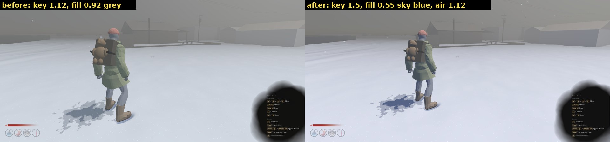
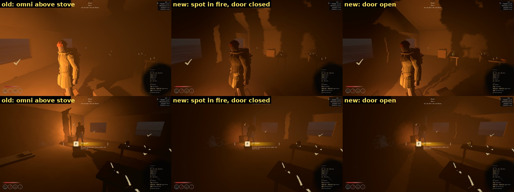
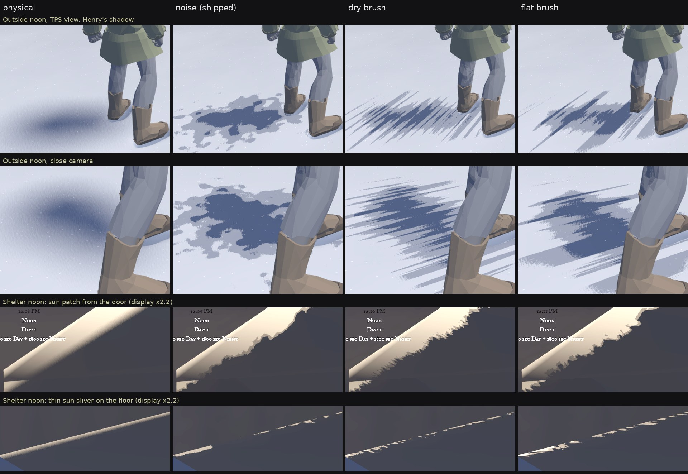

# Light and shadow direction

Status: research input for the author, 2026-10-01. It closes the shadow topic:
what the shipped contract already covers, what artists and the reference games
say is still missing around shadows, and what each gap would cost. Nothing
here is decided until the author marks it; items needing a call are tagged
**[decision]**.

Targets: **Disco Elysium** for the style, **The Long Dark** for execution (a
small team shipping a painterly real-time winter). "2.5D" here means the look
Blender NPR artists call 2.5D: full 3D that reads as painted or drawn. The
camera stays third person ([`tps_camera.gd`](../../scripts/systems/camera/tps_camera.gd));
there is no isometric camera. The shipped shadow model is described in
[`docs/technical/STYLIZED_SHADOWS.md`](../technical/STYLIZED_SHADOWS.md).

## What the references actually do

**Disco Elysium.** Environments are modelled in Blender, rendered as
isometric tiles (colour, shadows, normals, height) and painted over.
Everything that moves (NPCs, vegetation, pickups, particles) is real-time
3D on top. The height map sorts it in front of or behind the painting, the
normal map lets the scene be lit dynamically, and the shadow map combines with
the paintover ([ZA/UM devblog, "From Render to Paintover"][de-paint]). The look rests on
Aleksander Rostov's brushwork, muted browns, greys and blues with warm hues
used sparingly, and dramatic shadows ([MCV/Develop interview][de-mcv]).
*Lesson: one lighting language for world and characters; brushwork, not
shading maths, carries the style.*

**The Long Dark.** Hinterland summarise it as "broad areas of subtle texture
encased in sharp and simple silhouettes", built with texture brushes and bold
strokes, through concept, 3D and tech artists working together
([Creative Bloq][tld-cb]). Players trace it to the Group of Seven, Lawren
Harris and Emily Carr ([Hinterland forums, player discussion][tld-art]). A breakdown found no PBR:
reflections are painted into the diffuse, two texture maps per asset, real-time
lights (few at once), gradient boxes for god rays, and no ambient occlusion
([Seeberg, "The Long Dark Art Analysis"][tld-analysis]). *Lesson: simple
lighting, painted surfaces, strong silhouettes; atmosphere and palette do the
heavy lifting.*

**Diablo IV** (fully 3D, isometric, physically based) states its pillars as
"old masters" (controlled detail, tonal range and palette) and "a return to
darkness", with every element designed for the isometric camera
([Blizzard, March 2022 update][d4]). It is the closest shipped proof that a
3D 2.5D camera can read as painted without pre-rendered backgrounds.

## What artists say, and where Hoarbound stands

| Principle (source) | Hoarbound today | Gap |
|---|---|---|
| **Shadows take the colour of what fills them**: on a sunny day cast shadows are blue because they only see the sky ([Gurney, *Color and Light*][gurney]); in stylized shading shadows are a hue, not just darker ([Gooch/TF2][tf2]). | Done: day key 1.5 (1.0, 0.97, 0.92) against a sky-blue fill 0.55 (0.46, 0.58, 0.86). Before, key 1.12 and fill 0.92 were almost the same hue, and shadows read grey. | A warm key also warms the volumetric fog, so the key stays near neutral and the blue comes from the fill (see "Palette" below). |
| **Edge hierarchy**: cast shadows are sharpest where the caster touches and soften with distance; form shadows are softer than cast shadows; the sharpest edges sit at the focal point ([lost and found edges][edges], [Proko][proko]). | Cast shadows torn with one blur width everywhere; form shadow (N·L) physical and smooth. | Form shadow already matches the painters (keeps the author's "shadows only" decision). Missing: contact hardening and focal-point emphasis. |
| **Massing**: edit detail into big shapes; vary edge quality with the brush to steer the eye ([Disney, *Painterly CG concepts* / *Bolt*][disney]). | Shadow core is one flat value; islands only in the penumbra. | Textures keep full contrast inside shadow (painters simplify there). Future. |
| **Brushwork unifies everything** (Disco Elysium, The Long Dark, Disney "raypainting"; [Brushed Shading][brushed] bends normals through a painted stroke map). | Shadow islands come from procedural value noise. | When painterly textures arrive, the shadow breakup must use the same strokes, or it will read as a second, foreign texture. |
| **Paint sticks to surfaces**: strokes must stay fixed to the world, not the screen ([Meier 1996][meier]). Screen-space "painterly" filters such as Kuwahara smear the whole frame. | Noise is fixed in world space. A sub-pixel camera shift changed distant shadows exactly as much as physical ones (0.026 % of pixels each). | None. Keep effects in-material; reject post-process paint filters. |
| **Characters must read against the world**: TF2 uses rim highlights and value/saturation patterns so characters never blend into scenery ([Mitchell et al. 2007][tf2]); Disco Elysium lights its real-time characters with the painting's own maps. | Done: Henry's body, garments, Kenny, pack and carried props use the shared material with the shadow contract and a restrained rim on the lit silhouette edge. | Rim strength (0.6) is a look call. |
| **Ground the object**: a dark occlusion accent where things touch; AO is for grounding, not for faking shadows ([AO in games][ao]). The Long Dark ships without AO. | No AO; the sun's blur softens contact. | Optional: a subtle SSAO trial (it darkens only the fill, which is our shadow core). |
| **Atmosphere over realism**: fog and colour gradients carry depth (Firewatch, [Jane Ng, GDC 2015][firewatch]; The Long Dark). | Grey volumetric fog; shadows recede under it because fog is applied after shading. | Fog colour by time of day is a palette item **[decision]**, adjacent to shadows. |

Same scene and same shadow contract. Left: the old day key and fill (lit
snow 234/242/240, shadow 132/149/160 sRGB). Right: warm key 1.7 against a
sky-blue fill at 0.5 (lit 252/247/240, shadow 78/101/149). The shadow stops
being grey once the key dominates and the fill carries the sky's hue.

### Palette (shipped 2026-10-01)

Tried in Key West at noon. A warm key (1.0, 0.93, 0.82) turned the volumetric
fog and the sky beige, which breaks the cold mood. Shipped instead:

- a near-neutral key, 1.5 (1.0, 0.97, 0.92);
- a sky-blue fill, 0.55 (0.46, 0.58, 0.86);
- `DayNightSettings.day_atmosphere_light_energy` = 1.12, the energy the fog
  (`light_volumetric_fog_energy`) and the cloud lighting see.

The air reads exactly as before (fog/sky 138→139 sRGB). The shadow core under
Henry went from grey-green 88/93/91 to blue 70/78/89, and lit snow from
206/213/223 to 216/220/234. To revert, restore key 1.12 (1.0, 0.98, 0.95)
and fill 0.92 (0.58, 0.64, 0.70). Night is unchanged.

## A 2.5D look through a third-person camera

The camera sits 0.95–3 m behind Henry
([`tps_camera.gd`](../../scripts/systems/camera/tps_camera.gd)), so the
largest, closest surface on screen is Henry himself:

- **Shadows on Henry matter most.** Close up, a physically shaded character in
  a stylized world is the first thing that breaks the look. Painted 2.5D work in
  Blender keeps one shading language for characters and sets, as Disco Elysium
  does. Henry is now on the same shadow contract; see the roadmap.
- **Grain near the camera.** At 1–3 m a 1080p pixel is a few millimetres, so
  the spray (base 9 cycles/m, ~11 cm) reads as large brush blobs on and around
  Henry, never as pixel noise. Thin limbs take a third of the lookup offset, and
  the noise rides in model space so it does not slide over the body as he walks.
- **Readable silhouette.** A third-person view puts Henry against snow by day
  and against darkness by night; a restrained rim on the lit edge keeps him
  separate (TF2). It is stylistic, not physical, and set once for every
  character material.
- **Key light is composition.** Ground shadows still frame the view ahead of
  Henry. Long, readable shadows at dawn and dusk come from the sun's arc and
  palette, not from camera tricks. **[decision]** on art-directing the arc.

## Stove light: through the door, not all around

Before: the room light (`Flame`, omni, 4.2, range 6.5 m) hung 0.41 m above
the cooktop, outside the iron box, and lit every direction. The fire is inside
the firebox, so light should leave only through the door.

Now `StoveVisual` puts the room light, a shadowed `SpotLight3D`, in the fire,
0.16 m behind the door. The firebox walls and door bars are its shadow mask.
Range is 9 m with falloff 0.5, and the spot angle is 65°.

Predicted from the stove and room geometry, written down before the
verification render. Light at 0.50 m above the floor; far wall 6.74 m away;
ceiling 2.55 m. Brightness is calibrated on the measured old floor:
direct Y 0.02 at ~2.9 m, fill Y ~0.011.

- **Door closed.** Light leaves only through the five 4.6 cm gaps between
  the bars, at 0.49–0.64 m. That is 23 % of the opening, at elevations −2.5° to
  +41° and ±54° sideways.
  - No direct light on the floor: the lowest ray would land 11 m out.
  - The ceiling is lit from 2.3 m out; the far wall from 0.2 m up to the
    ceiling.
  - The bars throw 5 lit bands, about 1.9 m wide, with 1.5 m dark bars between,
    on the far wall.
  - Henry, 1.1 m in front of the stove, casts a silhouette about 3.6 m wide
    over the whole band.
  - Contrast: ceiling ΔL\* ≈ 20, far wall ΔL\* ≈ 15. With the old falloff 1.0
    it would be ≈ 7, so the falloff is lowered.
- **Door open.** Rays from −45° to +48°: a floor pool starts 0.5 m ahead of the
  light, about 0.35 m beyond the door.
- **Behind and above the stove.** No direct light; only the shadowless firebox
  glow (1.9, 2.2 m) and the fill.
- **Caveats.** The shelter walls' albedo is not measured, and fire strength
  changes energy linearly (0.5 at ignition, 1.0 when burning).

Verified on the same night with the fire at full strength (lavapipe, Key West).
Top row looks from the stove at the far wall; bottom row looks back at the stove.

| Check | Predicted | Measured (old → new) |
|---|---|---|
| Wall behind the stove | no direct light | L\* 41.1 → 20.8 |
| Floor mid-room, door closed | fill only (~10) | L\* 14.3 → 10.0 |
| Ceiling bands, door closed | ΔL\* ≈ 20, bar stripes | ΔL\* 10.2 without bands → 22.7 with 3–4 light/dark transitions |
| Far wall bands, door closed | ΔL\* ≈ 15 | 13.2 without bands → 16.4 with bands |
| Floor beside the stove, door open | a pool appears | L\* 15.7 closed → 19.4 open |
| Henry's silhouette on the far wall | ~3.6 m wide, ΔL\* ≈ 15 | ΔL\* 6.6 → 17.0 |

The lit stripes are narrower than the 1.9 m predicted, because the 2.5 cm
thick bars cut oblique rays further. With the door open the stripes go and a
large silhouette of Henry stays on the far wall. In third person, facing the
stove, it still falls behind the camera.

## Cloud shadows: calculated, not rendered

Calculated on the exact cloud texture the sky uses (seed 1731, simplex,
frequency 0.008, 5 octaves, 256², seamless), through the sky shader's own
layering (`hfn_layered_clouds`) and mask
(`smoothstep(cloud_coverage, 0.92, h) * cloud_opacity`). The sky draws
clouds on a plane at unit height: `uv = 0.2 * dir.xz / dir.y`. A cloud deck at
altitude H therefore maps one texture tile to 5H metres on the ground.

| Weather | Sky under cloud (alpha > 0.5) | Mean alpha | Cloud core | Edge 0.1→0.8 |
|---|---|---|---|---|
| Clear (coverage 0.30, opacity 0.88) | 1.9 % | 0.06 | 0.039 tile = 0.2H (290 m at 1.5 km) | 0.082 tile = 0.4H (615 m) |
| Snowfall 0.5 | 1.0 % | 0.02 | 0.034 tile | 0.055 tile |
| Heavy snow | 0.4 % | 0.01 | 0.027 tile | 0.030 tile |

What it would look like:

- Shadows consistent with the sky would cover ~2 % of the ground, whatever
  H is.
- The patches are hundreds of metres across, against a view that the depth
  fog closes at ~100 m. The player would see a rare, slow dimming of the
  whole view, never a cloud shape on the snow.
- If a cloud does pass overhead (new palette: lit snow L\* 87.8, fill
  only 32.9), alpha 0.3 / 0.6 / 0.88 darkens snow by ΔL\* 10 / 24 / 42.

**Not implemented: there is nothing to see.**

An art-directed alternative, decoupled from the sky:
- patches 40–60 m, ~35 % coverage, 10 m edges, drifting 3–5 m/s, alpha 0.6;
- through the tone cut that gives ΔL\* ≈ 21–24, about three edges inside a
  100 m view, and a 2–3 s crossing at any point.

It contradicts a sky that shows 2 % cloud, so it needs a denser sky first.
**[decision]**

Finding, not changed: weather raises `cloud_coverage` with snowfall
(`DayNightManager.apply_weather_visual_profile`), but the sky shader uses it as
a threshold. Snowfall therefore thins the clouds: 1.9 % → 0.4 % of the sky.

## Brush-stroke sources for the shadow mask

The spray and lookup offset will read from a tileable stroke mask instead of
value noise once painted textures exist. Sources close to the Blender "2.5D" look:

- **Blender Studio Brushstroke Tools** (made for Project Gold; add-on under
  GPL-3.0, Blender 4.2+). Generated strokes are our own output. Recommended:
  fill a plane with strokes, bake top-down to a 1024² tileable grayscale mask.
  [extension][bst], [workshop][bst-train].
- **David Revoy's Krita brushes**, CC0: paint the mask by hand, including
  rakes and grungy stamps. [bundle][revoy].
- **Stylized Textures**, CC0 4K stylized PBR sets: candidates for the painted
  surfaces themselves. [BlenderNation][stylized].
- OpenGameArt hand-painted sets: licences vary per asset, so check each
  ([example][oga-hp]).

Integration: sample the mask triplanar in world space (model space on Henry), as
the reference did with its noise texture. Keep the ±0.3 jitter margins and tile
at 1.5 m. Until an artist bakes a mask,
[`generate_shadow_brush_masks.py`](../../tools/art/generate_shadow_brush_masks.py)
stamps two placeholder masks with the right structure: **dry** (thin strokes
with bristle streaks) and **flat** (wide, even strokes). Both run at 35° in
world space. The global `stylized_shadow_brush_mix` blends noise (0) into the
mask (1), and `stylized_shadow_brush_mask` picks the mask.

### Brush masks: calculated before rendering

Offline, on a 1.5 m ground patch, with the shader's own hash, noise and cut
(`v = attenuation + 0.3·spray`, cuts 0.34 / 0.66):

| | noise (shipped) | dry | flat |
|---|---|---|---|
| Spray std / share clamped at ±1 | 0.59 / 13 % | 0.75 / 34 % | 0.85 / 49 % |
| Stroke direction agreement (0 = none, 1 = all) | 0.05 | 0.95 at 35° | 0.86 at 34° |
| Correlation length along / across the stroke | 6.9 / 5.9 cm | 3.4 / 0.9 cm | 6.7 / 2.1 cm |
| Lit islands mid-penumbra: elongation (median) | 1.8 | 5.5 | 10.8 |
| Tones mid-penumbra, core / mid / lit | 0.18 / 0.55 / 0.27 | 0.32 / 0.34 / 0.34 | 0.36 / 0.14 / 0.50 |
| Tones over the whole penumbra | 0.31 / 0.33 / 0.36 | 0.34 / 0.33 / 0.33 | 0.31 / 0.33 / 0.36 |

Reading:

- The masks are nearly two-valued (stroke or gap), so in the middle of the
  penumbra they cut straight from core to lit. Mid tone moves to the band's
  edges: mid strokes on the core side, mid gaps on the lit side. The penumbra
  keeps a third of its area in mid tone either way.
- Dry is finer than the noise: 0.9 cm across, 1–3 px at Henry's distance. It
  should read as hatching. Flat matches the noise's scale along the stroke.
- **Mipmaps do not fade a stroke mask.** With a 4.8 cm pixel footprint the
  noise spray is gone (std 0.01), but mip-averaged masks keep std 0.47 (dry)
  and 0.71 (flat), and 0.33 / 0.56 at 9.6 cm. The unpainted gaps are as large
  as the strokes, so averages do not settle to 0.5. Distant shadows would stay
  blotchy, with a visible 1.5 m repeat. The shader therefore fades the mask on
  the same window as the noise's base octave: from 2.2 to 5 cm per pixel. On
  the ground from the TPS camera (70° FOV, 1080p, eye ~1.9 m) that is 5.7 to
  8.5 m away; on a wall facing the camera, 17 to 38 m.
- Cost: the mask replaces the 24-hash spray fbm with three texture reads.

Predictions for Key West (noon outside, Henry close-up, shelter at noon):

1. Pixels that differ between noise and a mask lie only in the penumbra. Fully
   lit and fully shadowed pixels match within the frame-to-frame floor (noise
   rendered twice).
2. Nothing changes beyond ~8.5 m on the ground: no difference above the floor
   in the top part of the outside frame.
3. In the penumbra, the mask frames show one stroke direction; the noise does
   not. Measured as direction agreement of the stylized minus physical
   difference, expect noise < 0.2 and both masks > 0.4 (perspective lowers the
   offline values).
4. Flat reads as brush strokes; dry as fine hatching that may break up on
   Henry. Expected pick: flat.

### Brush masks: measured in Key West

`capture_stylized_shadows.gd -- brush`, lavapipe, noon. Each view rendered
physical, noise, noise again (the floor: falling snow and Henry's idle motion),
dry and flat. Pixels count as changed above 4 L\* after a 7 px median, which
removes small snowflakes; Henry and the HUD are masked out.

| Prediction | Measured | Verdict |
|---|---|---|
| 1. Only the penumbra changes | Shelter: floor 0.02 %, dry 0.29 %, flat 0.44 % of the frame, all on the edges of sun patches; lit and dark interiors identical. Outside, near band (< 5.7 m): floor 0.50 %, dry 1.47 %, flat 1.52 %, all in Henry's shadow. | Holds |
| 2. Nothing changes beyond ~8.5 m | Far ground band: floor 0.19 %, dry 0.49 %, flat 0.40 %. Every changed blob there is a near-camera snowflake larger than the median filter; the bench and porch shadows at ~25 m are identical in all variants. | Holds |
| 3. Masks show one direction, noise does not | Close camera, shadow region: noise 0.20, dry 0.66, flat 0.50. TPS view, ground under the shadow: noise 0.58, dry 0.86, flat 0.83. There the noise follows the perspective-squashed outline of the shadow (167° on screen against the physical 172°). The masks set their own direction (145°). | Holds for the masks; noise was not isotropic in the TPS view |
| 4. Flat reads as strokes, dry as hatching | Dry turns Henry's shadow into a scratchy hatch and the shelter edge into a comb. Flat gives broad strokes and a torn, coastline-like shelter edge. No mask showed on Henry's body here: his lit side faces the camera. | Holds |

Found, not predicted:

- **Thin sun slivers are all penumbra**, so the spray alone decides what stays
  lit. A shelter floor sliver keeps 49 % of its length with the shipped noise
  (15 pieces), 66 % with dry (21 pieces) and 79 % with flat (15 pieces). The
  noise loses more of the sliver than either mask. This is a limit of the
  shipped contract too.
- At noon Henry's whole shadow is penumbra (shadow blur 3.3 over a small
  caster), so the masks restyle the entire shadow, not just its rim. Strokes
  run past the physical blob as mid-tone streaks, about one stroke length.

Recommendation: **flat**, when the surfaces get painted textures. The global
stays at noise (`stylized_shadow_brush_mix = 0`) until the author decides. To
look at it in the editor, set the mix to 1 in Project Settings › Shader Globals;
the mask global selects dry or flat. A baked mask from Brushstroke Tools drops
in as the same 1024² grey PNG.

## Henry's shadow in the shelter: measured

Same night, same view, with and without Henry, firebox glow on and off. With
the old light above the stove:

- Henry cast a stove shadow: 4.5 % of the frame darkened by more than 4 L\*,
  10 L\* on average.
- The firebox glow did not fill it: coverage was the same with the glow off.
- The floor it fell on was dim: lit L\* 21, shadowed 9–12, key:fill 1.3–2.5.
- In third person, facing the stove, that shadow falls behind the camera.

Cause: the room light hung above the stove. Fixed by the stove-light change
above; see its verification.

[bst]: https://extensions.blender.org/add-ons/brushstroke-tools/
[bst-train]: https://studio.blender.org/training/stylized-rendering-with-brushstrokes/get-started-using-brushstroke-tools/
[revoy]: https://www.davidrevoy.com/article1060/krita-brushes-2025-01-bundle/show
[stylized]: https://www.blendernation.com/2025/11/04/cc0-stylized-textures/
[oga-hp]: https://opengameart.org/content/8-handpainted-style-textures

## Roadmap

| Priority | Item | Cost | Needs |
|---|---|---|---|
| P0 | Check the frame cost of Soft High and the stove's cube shadow on a real GPU | an editor session | author's machine |
| P1 | ~~Character shader on the shadow contract, with rim light~~ Done 2026-10-01: body, garments, Kenny, pack, carried logs and boards | — | rim strength is a look call |
| P1 | ~~Day palette: key over a sky-blue fill~~ Done 2026-10-01; dusk and night unchanged | — | look check in the editor |
| P2 | ~~Brush-stroke mask drives the spray~~ Built 2026-10-01, off by default: dry and flat placeholder masks, measured in Key West (above). The lookup offset stays on noise | — | **[decision]**: noise or flat; an artist's baked mask |
| P2 | Three-tone halo for the stove: the stove publishes its position, range and decay, and `light()` divides its falloff out of `ATTENUATION` | half a day | **[decision]**: couples one light to the material |
| P2 | Grounding: SSAO. A trial at noon (radius 0.8, intensity 1.5, ambient only) was inconclusive. On open snow it changed a mean 1 level per pixel, inside the frame-to-frame noise of falling snow and idle animation. It needs a static, contact-rich view (shelter props, city kerbs) | hours | look check |
| P3 | Sharper edges near Henry (focal point), softer far away | hours | P1 first |
| P3 | Flatter texture contrast inside shadow (massing) | needs custom ambient handling | painterly textures |
| P3 | Cloud-shadow masses: calculated, nothing visible with today's sky; art-directed variant needs a denser sky | hours | **[decision]** |

Not recommended, with reasons:

- **Ink outlines (Sobel or ID masks).** Neither reference uses them, and the
  experiment was already removed (issue #1).
- **Screen-space painterly filters (Kuwahara and the like).** They break
  "paint sticks to surfaces" and smear UI and particles.
- **Banded N·L.** It goes against the author's "shadows only" decision, and
  painters keep form-shadow edges softer than cast ones anyway.

## Known limits of the shipped contract

- Hard tone-cut edges flip a few pixels under sub-pixel camera motion: 0.37 %
  of the near band against 0.15 % for physical shadows. Shading is not
  antialiased; FXAA covers part of it.
- Local lights (the stove, flares) tear their shadow, but have no tone cut until
  the P2 item above lands.
- A sun sliver narrower than the penumbra is all penumbra, so the spray breaks
  it into pieces: the shelter floor sliver keeps 49 % of its length.

## Research notes

Most pages could not be opened from the build container (egress policy), so the
statements above come from search-result summaries of the cited pages. Treat
direct quotes as second-hand until checked against the source. The images
and measurements are first-hand, rendered on Godot 4.8-dev6 (lavapipe).

[de-paint]: https://www.gamebanshee.com/news/121823-disco-elysium-from-render-to-paintover.html
[de-mcv]: https://mcvuk.com/business-news/we-knew-immediately-that-we-needed-to-make-a-game-with-a-striking-and-unique-look-to-accompany-the-writing-a-look-that-would-balance-the-mundane-with-the-unfamiliar-and-strange-the-art/
[tld-cb]: https://www.creativebloq.com/how-to/how-to-create-stylised-game-artwork
[tld-art]: https://hinterlandforums.com/forums/topic/22008-art-history-and-tld/
[tld-analysis]: https://austenseeberg3d.blog/2020/03/03/the-long-dark-art-analysis/
[d4]: https://news.blizzard.com/en-us/article/23788294/diablo-iv-quarterly-updatemarch-2022
[gurney]: https://www.christian-sauve.com/?p=5429
[tf2]: https://www.advances.realtimerendering.com/s2007/Mitchell-IllustrativeRenderingInTF2(Siggraph07%20Course%20Notes).pdf
[edges]: https://creativebloq.com/illustration/theory-behind-lost-and-found-edges-explained-51620585
[proko]: https://www.proko.com/course-lesson/intro-to-edges
[disney]: https://media.disneyanimation.com/uploads/production/publication_asset/64/asset/painterlyCgConcepts.pdf
[brushed]: https://superhivemarket.com/products/brushedshading
[meier]: https://history.siggraph.org/?p=117028
[ao]: https://gdcvault.com/play/1015320/Ambient-Occlusion-Fields-and-Decals
[firewatch]: https://gdcvault.com/play/1022923/Making-the-World-of
[clouds]: https://github.com/EntroPi-Games/Unity-Cloud-Shadows/
