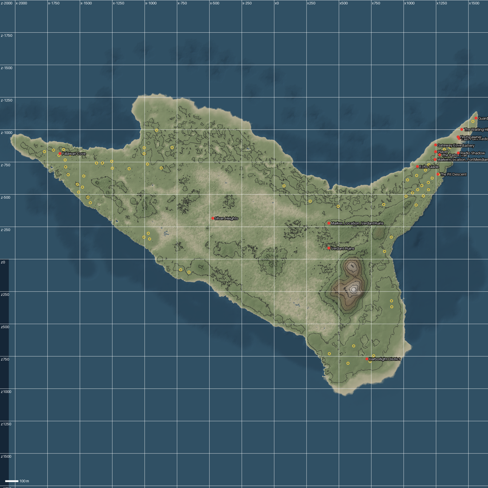
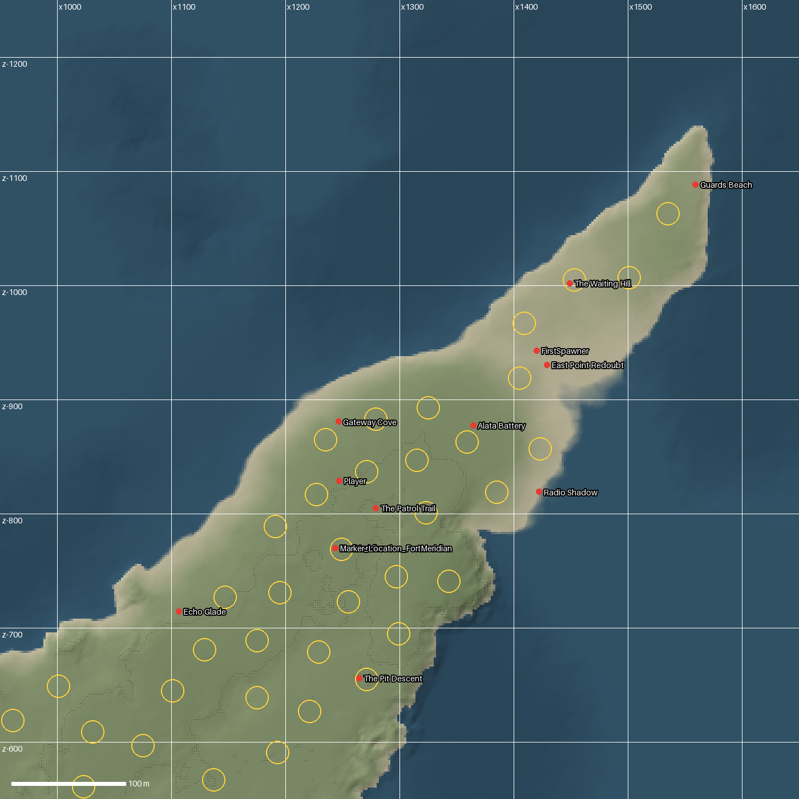
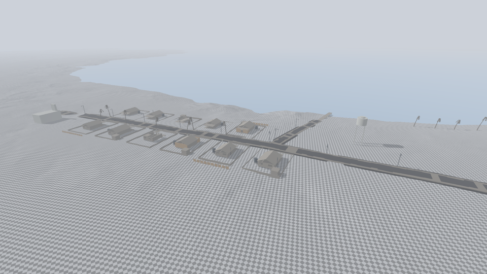
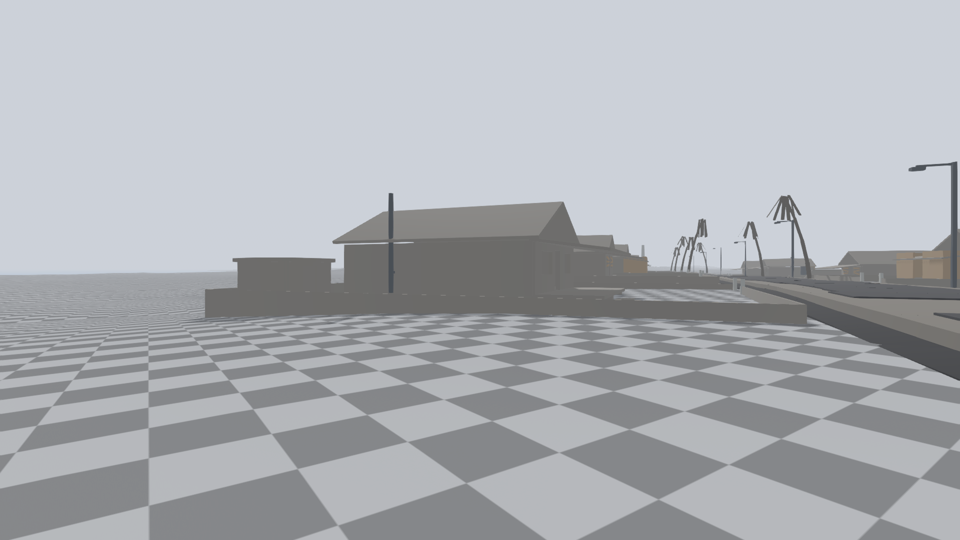
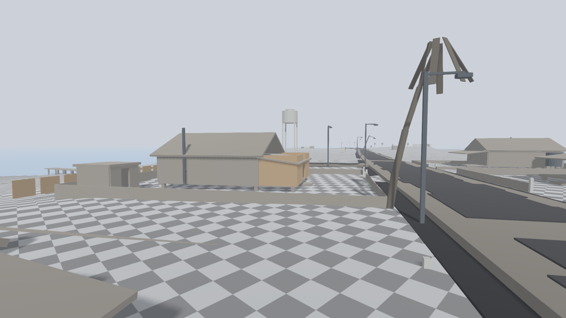
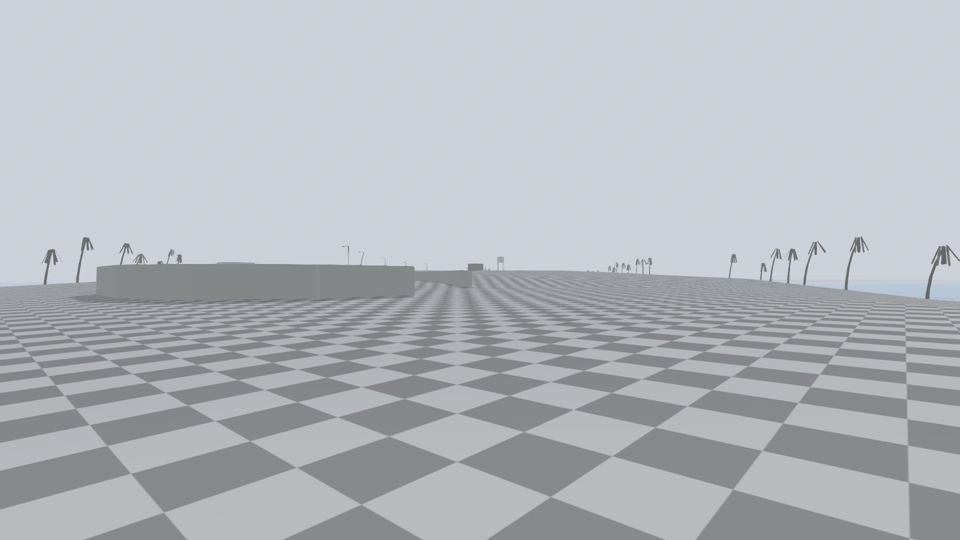
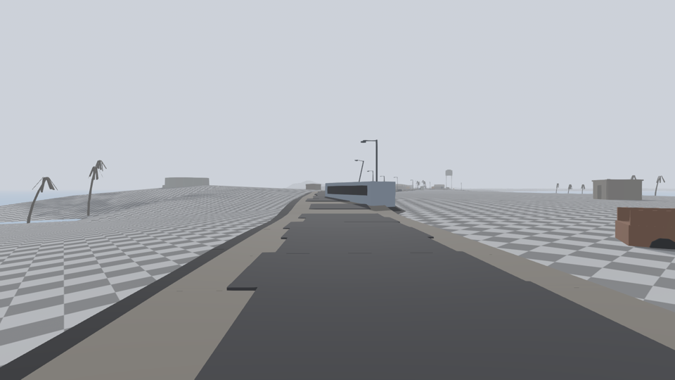
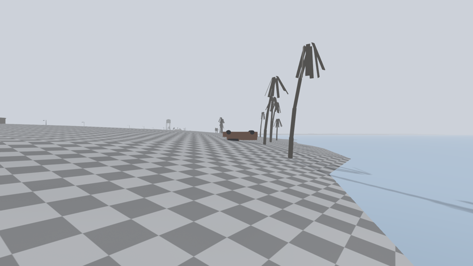
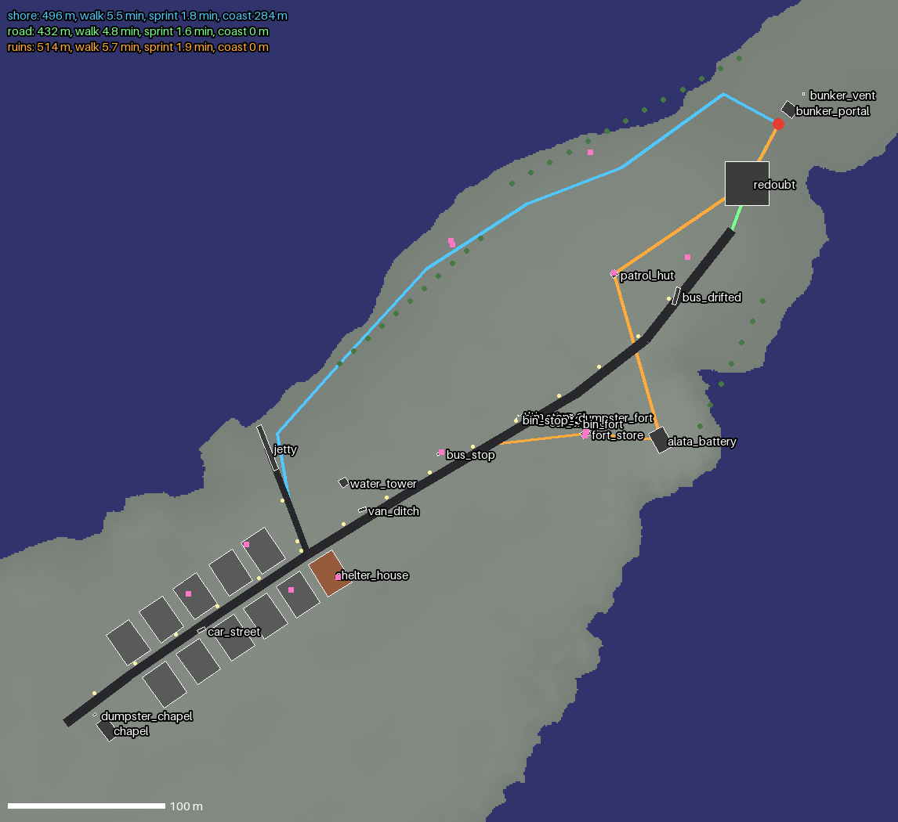

# First Exit: where the game starts on Graciosa

The shared reference for every agent working on milestone **First Exit**
([#42](https://github.com/Nolavel/Henry-s-Feral-Night/issues/42), north star
[#24](https://github.com/Nolavel/Henry-s-Feral-Night/issues/24)). Numbers come
from the real heightfield; the tools below regenerate them.

**Source of truth for positions:** `data/world/first_exit_layout.json`.
Edit coordinates there, never by hand in the scene.

## Coordinates

- Godot world metres. **+X east, −Z north**, Y up. Sea level is **0.0** (the sea
  plane sits at 0.04). Maps in this folder draw north up.
- The island is the Terrain3D in `experimental_location/Graciosa/terrain_graciosa`
  (5 regions of 2048 m, 1 m vertex spacing). Main scene:
  `experimental_location/scenes/Graciosa_Island_Terrain.tscn`.

## The island in numbers



| Metric | Value |
|---|---|
| Land area | 3.44 km² |
| Extent | 3.6 km E–W (x −2036…1572) × 2.3 km N–S (z −1276…1046) |
| Height | max 39 m (the south-central hill), median 4.2 m, p90 6.8 m |
| Character | Low and flat: most of the island is 1.5–7 m above the sea |

Yellow circles are **buildable sites**: a 10 m-radius disc whose steepest
slope is under 6° and which stays above the tide line. Any of them takes a
house without terrain edits.

## Start point: the east peninsula (Fort Meridian)



Henry starts at **`FirstSpawner` (1420, 3, −943)** on the east peninsula, facing
**yaw 132°**, toward the suburb and its water tower. The peninsula runs ~800 m
south-west from the tip at Guards Beach and is **150–250 m wide**.

The scene already names this sector (Label3D and streaming chunks):
East Point Redoubt, Alata Battery, Gateway Cove, The Patrol Trail, Radio
Shadow, The Waiting Hill, Echo Glade and The Pit Descent. The greybox reuses
those names: a colonial fort on a former tropical island.

## Greybox: a suburb on the old road

`scenes/world/first_exit/first_exit_blockout.tscn` is instanced in the main
scene and generated from the layout. Every piece has collision. Houses and
sheds have door and window gaps, so they can be entered and later carry
`ShelterBreach` points. **The spatial logic comes first, prop count second**
(author, PR #43): in a frame with no labels a player should read that a road
ran here, that a suburb lined it, that the bungalow belongs to that suburb,
and that the cold came after the settlement was built.

**The road** (`roads` in the layout) is the old coast road. It runs from the
fort (1390, −875) south-west through Santa Cruz's edge to the chapel.
- It is built as a gravel bed with a 6 m carriageway, 1 m shoulders and
  drainage ditches on both sides.
- About 12 % of the asphalt pieces are missing, so the bed shows through.
- A lane branches north at the **junction** (1120, −668) to the jetty. This is
  the one crossroads, and the jetty continues the lane into the frozen sea.
- Street lamps stand on the verge. About a quarter lean, some have lost their
  heads, and one lies across the ditch.

**Lots** (`lots` in the layout) are placed by distance `s` along the road and
a side, not by coordinates. Each lot is 18 × 24 m and gets:
- the house facing the road, a gravel driveway to the carriageway, and a low
  fence with a gate at the driveway;
- optionally a yard shed and a raised water tank;
- the **winter retrofit layer**: `boarded` openings, a `vestibule` enclosing
  the veranda, a `stovepipe` through the wall, `insulation` panels on the cold
  side, a `snow_fence` upwind;
- a state: kept, `roofless` or `collapsed`.

Eleven lots, five north and six south. The builder writes every final
position to `docs/world/first_exit_resolved.json`: **agents read positions from
there**.

| Anchor | Where | Role |
|---|---|---|
| `bunker_portal` | 1427, −952, 11 m behind the spawn | Locked exile door |
| `redoubt`, `patrol_hut`, `alata_battery`, `fort_store` | 1300–1400, −740…−905 | Fort ruins at the head of the road: loot, detours |
| `bus_stop` | north verge of the road | Proof of the old bus line; halfway wind shelter |
| `water_tower` | north of the junction | Suburb landmark, **visible from the bunker door** (360 m) |
| `shelter_house` | first lot south of the junction | Destination on the near edge of the suburb. Its original tropical openings are still open: the player boards them. |
| `jetty` | end of the lane | Ties the suburb to the sea |
| `chapel` | end of the street, south side | Closes the street view |
| Palms | north beach, cove, south shore, and the road verge between lots | Planted avenue of the old town, now dead |






## Route clutter

`clutter` in the layout holds wrecks and street furniture. Each entry is
placed on a road (`s`, `side`, `lateral` from the centreline or `offset` from
the verge, `yaw_add`) or at world coordinates. Vehicles take `roll` (`side` or
`roof`), `sink` into drift, and `door_open`.

The purpose is spatial grammar, not decoration. Clutter breaks the straight
sprint line, creates soft choke points and wind shadow, and shows tropical
traffic caught by the cold. Density stays low and route-specific:

| Route | Clutter |
|---|---|
| Road | A bus half-sunk across the north lane near the fort; a car with its door open by the bus stop; bins at the stop; a van on its side in the ditch before the junction; a car abandoned among the houses; a dumpster at the chapel |
| Shore | Two pickups on the north sand, one on its roof, one on its side |
| Ruins | A dumpster and a bin by the powder store; the garrison pickup nosed into the redoubt slope |




## Kenny on the pack

Kenny is an item (`data/items/kenny.tres`, 3 kg, bulky, no garment facet).
He starts in the `back_fixture` slot through
`EquipmentComponent.starter_slot_items`. His weight counts toward the carry
limit through `EquipmentComponent.get_carried_weight()`, so he costs load from
the first step. He is drawn as a plush silhouette strapped to the outside of
the pack, and he disappears if he leaves the fixture.

## The working loop in the route

The shelter lot carries the TestScene loop, generated by the builder:
- **ShelterZone**: an interior `ThermalZone` filling the house.
- **Five `ShelterBreach` openings**: the front door, two front windows and two
  back windows. Each has hidden planks and a `BreachBoardUp` prompt that
  spends one `boards`.
- **Stove**: a `HeatSource` heating the zone, with a `HeatSourceFeed` prompt.
  Firewood feeds it; tinder is needed to light it cold.
- **Sleep and save** need nothing extra. `SleepController` accepts any
  sheltered, warm enough `ThermalZone`.

`pickups` in the layout puts items on the ground, relative to a built anchor
(`anchor`, `local`) or at world coordinates. The resolved positions are listed
in `first_exit_resolved.json`.

| Where | Items | Route |
|---|---|---|
| Fort powder store | boards ×2, tinder | ruins |
| Patrol hut | tinned stew | ruins |
| Bus stop | firewood | road |
| Next-door lot (s2) veranda | boards | suburb |
| Shed of lot n1 | firewood ×2 | suburb |
| Collapsed house n3 | tinder | suburb |
| Inside the shelter | firewood | — |
| Wrecked pickup on the beach | tinned stew | shore |

**Scarcity is deliberate.**
- There are 5 openings but only 3 boards, so the player chooses which side of
  the house to seal against the wind.
- Tinder lies only in the fort store or the collapsed house: no detour, no
  fire.
- `test_first_exit_route.gd` checks these rules, so a later layout edit cannot
  make the shelter free.

## Clothes on the body

Each worn garment shows as a greybox layer on Henry: knit hat, coat with
sleeves, trousers, boots. A layer disappears when the garment comes off.
Wetness from the thermal model darkens every layer, so a soaking reads on
the body, not only in the HUD.

## Movement speed

Henry now moves at human speed (author): **walk 1.5 m/s, sprint 4.5 m/s**, down
from 4 and 8. The locomotion blend points moved with it (walk 0.33, jog 0.67 of
sprint). The ice drain was rescaled so the damage per tile crossed is
unchanged (see `ICE_SYSTEM.md` §7).

## Routes, measured



Each route ends at the shelter's front door.

| Route | Length | Walking | Sprinting | Wind-exposed coast band (< 25 m from shore) |
|---|---|---|---|---|
| Road (past the fort) | 432 m | 4.8 min | 1.6 min | 0 m |
| Shore (north beach) | 496 m | 5.5 min | 1.8 min | **277 m** |
| Ruins (fort detour) | 514 m | 5.7 min | 1.9 min | 0 m (loot stops add time) |

At walking pace a one-way crossing is about 5 minutes. With searching,
boarding, firing the stove and the weather turn, that fits the milestone's
10–15 minutes.

## Ice: pending the coastal zone

The inland lagoon is **rejected** (author, PR #43). Ice belongs to the real
coast: small islets and atolls, frozen straits and ice bridges between them,
shoals, the shore-fast ice edge, and ice-locked ships as landmarks, shelters
and risk points. Until that zone exists, the `ice` route is unconfirmed and
nothing in the greybox assumes it.

## Reference: the tropical island before the cold

Typology, not a copy of a real place. It sets scale for props.

- **Houses**: Caribbean and Pacific creole bungalows. They are single storey,
  6–9 × 8–12 m, and stand on piers 0.6–1 m high for airflow. They have a
  2.5–3 m veranda, tall louvred windows (sill ~0.9 m, head ~2.0 m), light
  timber walls and a corrugated hip roof. Everything is built to *lose* heat,
  which is why they make bad winter shelters: every opening is a breach.
- **Retrofit layer** (later survivors): boarded windows, a stove pipe cut
  through a wall, the veranda enclosed as a cold porch, one inner room sealed.
- **Civic landmarks**: a church gable and a water tower (12–20 m). They rise
  above a flat, low town and read from half a kilometre away.
- **Fortifications**: 18th–19th-century colonial batteries and redoubts. They
  have low, thick stone walls (2–3 m), gun pits on the highest ground and
  small powder stores. The scene's own names (Redoubt, Battery, Patrol Trail)
  already describe this.
- **Palms**: coconut palms reach 15–25 m when mature (the greybox uses 7–11 m
  broken or young ones). They lean seaward, stand irregularly on beaches and
  7–9 m apart in groves. Dead ones lose the crown, and the grey fronds hang
  straight down.
- **Coast**: sand bars and salt ponds behind the beach. Mangrove stumps would
  sit in the coastal shallows.

## Regenerating

The terrain source is now the heightmap PNG (`docs/world/TERRAIN_HEIGHTMAP.md`). The route tools take
`world/terrain/source/graciosa_height.png` in place of the dump directory. Terrain3D is still what
renders the island until stage 2 of that plan lands.

```bash
# 1. heights + scene markers -> user://island/
godot --headless --path . --script res://tools/world/dump_island_heights.gd
D="$HOME/.local/share/godot/app_userdata/Henry\`s Feral Night/island"
# 2. maps and buildable sites (whole island, then a window: cx cz half_m)
python3 tools/world/island_report.py "$D" docs/world/graciosa_overview
python3 tools/world/island_report.py "$D" docs/world/first_exit_area 1300 -900 350
# 3. route metrics (run after step 4: reads first_exit_resolved.json)
python3 tools/world/route_metrics.py "$D" data/world/first_exit_layout.json docs/world/first_exit_routes
# 4. rebuild the greybox scene from the layout
godot --headless --path . --script res://tools/world/build_first_exit_blockout.gd
# 5. renders, one shot per process (light stage; HFN_FULL_SCENE=1 for the real scene)
for i in 0 1 2 3 4; do HFN_SHOT=$i xvfb-run godot --path . --rendering-driver vulkan --script res://tools/runtime/capture_first_exit.gd; done
```

Python needs `numpy`, `scipy`, `pillow` and `matplotlib`.

## Known issue (resolved)

The full Graciosa scene crashed under lavapipe. The crash came from Terrain3D,
and the main scene now runs on `IslandTerrain` (see `TERRAIN_HEIGHTMAP.md`).
Captures render the real scene with `HFN_FULL_SCENE=1`.
