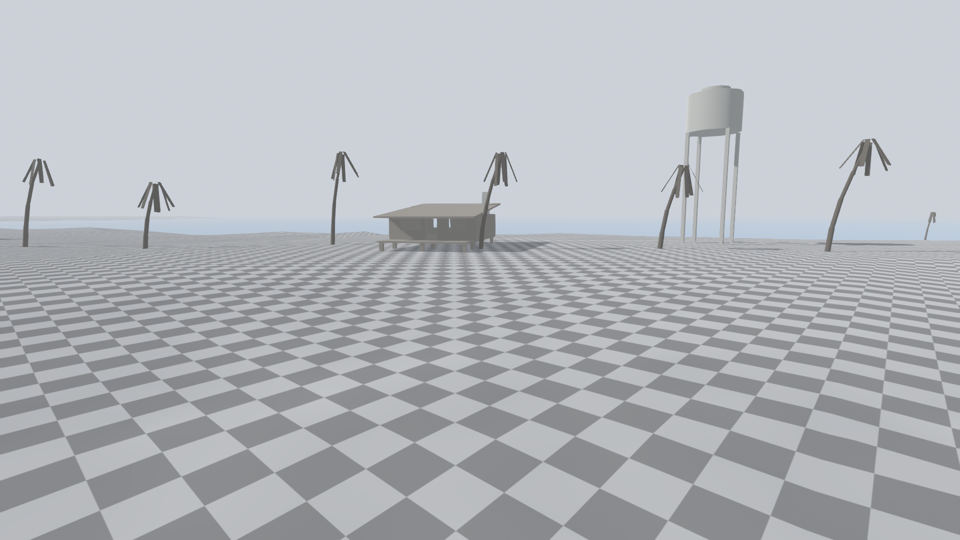
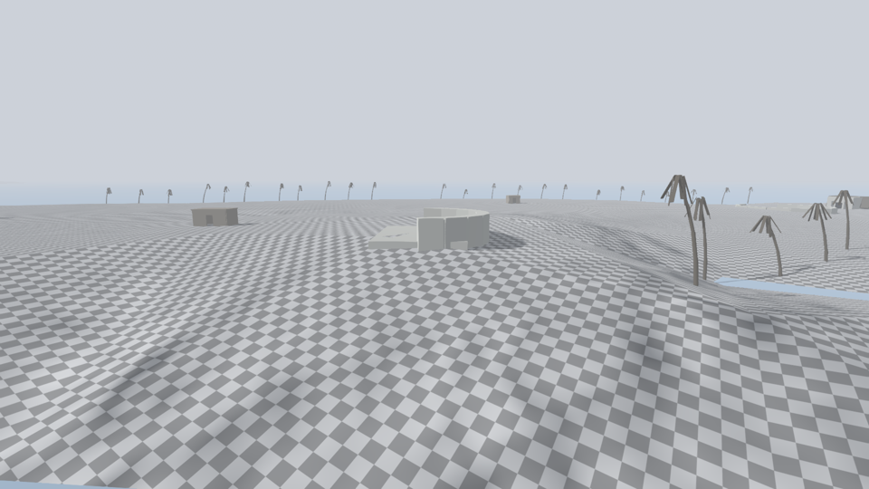
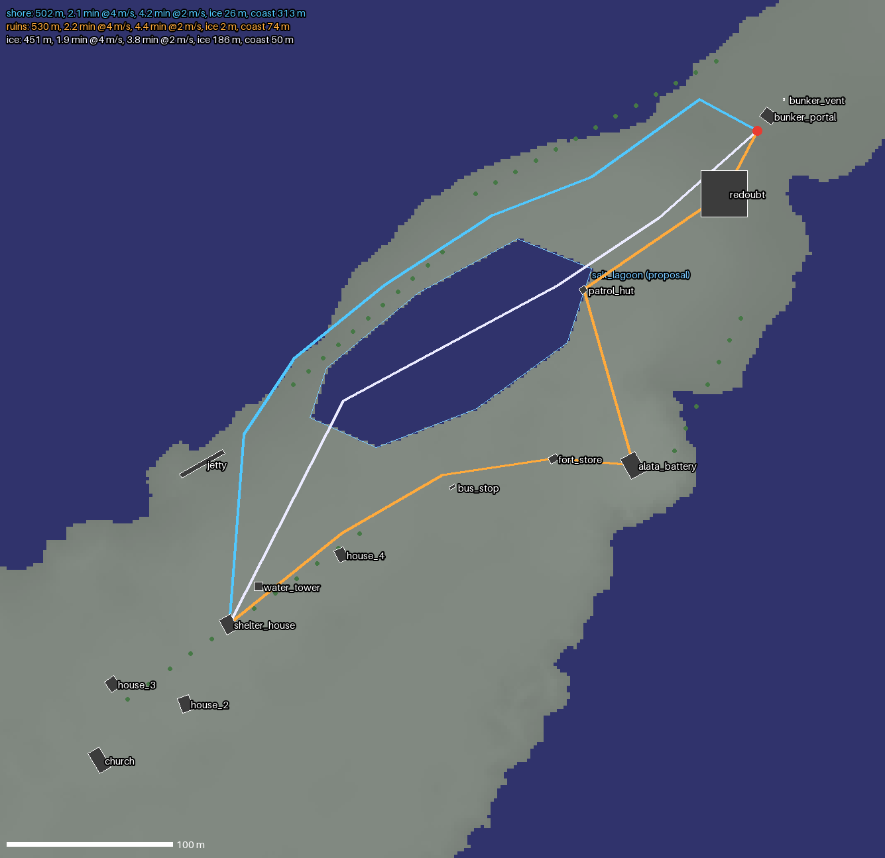

# First Exit: where the game starts on Graciosa

The shared reference for every agent working on milestone **First Exit**
([#42](https://github.com/Nolavel/Henry-s-Feral-Night/issues/42), north star
[#24](https://github.com/Nolavel/Henry-s-Feral-Night/issues/24)). Numbers come
from the real heightfield; the tools below regenerate them.

**Source of truth for positions:** `data/world/first_exit_layout.json`.
Edit coordinates there, never by hand in the scene.

## Coordinates

- Godot world metres. **+X east, −Z north**, Y up. Sea level is **0.0** (the sea
  plane sits at 0.04). Maps in this folder draw north up.
- The island is the Terrain3D in `experimental_location/Graciosa/terrain_graciosa`
  (5 regions of 2048 m, 1 m vertex spacing). Main scene:
  `experimental_location/scenes/Graciosa_Island_Terrain.tscn`.

## The island in numbers


| Metric | Value |
|---|---|
| Land area | 3.44 km² |
| Extent | 3.6 km E–W (x −2036…1572) × 2.3 km N–S (z −1276…1046) |
| Height | max 39 m (the south-central hill), median 4.2 m, p90 6.8 m |
| Character | Low and flat: most of the island is 1.5–7 m above the sea |

Yellow circles are **buildable sites**: a 10 m-radius disc whose steepest
slope is under 6° and which stays above the tide line. Any of them takes a
house without terrain edits.

## Start point: the east peninsula (Fort Meridian)


Henry starts at **`FirstSpawner` (1420, 3, −943)** on the east peninsula, facing
**yaw 132°**, which points at the water tower. The peninsula runs ~800 m
south-west from the tip at Guards Beach and is **150–250 m wide**.

The scene already names this sector (Label3D and streaming chunks):
East Point Redoubt, Alata Battery, Gateway Cove, The Patrol Trail, Radio
Shadow, The Waiting Hill, Echo Glade and The Pit Descent. The greybox reuses
those names: a colonial fort on a former tropical island.

## Greybox

`scenes/world/first_exit/first_exit_blockout.tscn` is instanced in the main
scene. Every piece has collision; houses and sheds have door and window gaps
so they can be entered and later carry `ShelterBreach` points.

| id | What | Position (x, z) | Role |
|---|---|---|---|
| `bunker_portal` | Blast door in a concrete face, earth berm | 1427, −952 | Locked exile door; Henry starts 10 m in front |
| `redoubt` | Low stone ring, Ø 28 m, 2.2 m high | 1400, −905 | First wind break |
| `patrol_hut` | Sentry hut 4×4 m | 1315, −847 | Ruins route: food tin |
| `alata_battery` | Gun pit on the highest flat ground (7.8 m) | 1345, −741 | Ruins route landmark |
| `fort_store` | Powder store 6×4 m | 1297, −745 | Ruins route: boards, tinder |
| `bus_stop` | Roadside shelter | 1236, −728 | Visible halfway wind shelter |
| `shelter_house` | Bungalow 8×10 m on 0.8 m piers, 3 m veranda, big openings, retrofit chimney | 1101, −645 | **Destination**: the repairable shelter |
| `water_tower` | 16 m tower | 1119, −668 | **Landmark**, visible from the bunker door |
| `house_2`…`house_4`, `church` | Santa Cruz outskirts | 1023…1169, −563…−687 | Silhouette, later loot |
| `jetty` | 30 m pier into the frozen sea | 1085, −742 | Future ice access |
| palm rows | 36 dead coconut palms, 7–11 m, lean to seaward | north beach, cove, village lane, south shore | Tropical past |





## Routes, measured



| Route | Length | @ 4 m/s (current walk) | @ 2 m/s | On ice | Wind-exposed coast band (< 25 m from shore) |
|---|---|---|---|---|---|
| Shore (north sand bar) | 502 m | 2.1 min | 4.2 min | — | **313 m** |
| Ruins (fort detour) | 530 m | 2.2 min | 4.4 min | — | 74 m |
| Ice (across lagoon) | 451 m | 1.9 min | 3.8 min | **186 m** | 50 m |

With the lagoon (next section), the ice route is shortest and least
wind-exposed, but it carries the ice risk. The shore route spends the longest
time in the coastal wind. The ruins route is the longest and pays for it with
loot.

## Decisions the author must make

1. **Ice needs a lagoon.** On the current terrain the peninsula has no bay:
   the best sea shortcut found by search saves only 15–17 %, and the drafted
   ice route was the *longest* (574 m). The proposal is a **frozen salt lagoon**
   (polygon `salt_lagoon` in the layout JSON, about 180 × 90 m, 1.5 m deep)
   across the peninsula. Salt ponds of this kind are typical of dry tropical
   islands (Bonaire, Anguilla, Culebra). The lagoon is **not carved yet**:
   editing Terrain3D is a content decision.
2. **Walk speed 4 m/s is about 2.8× a human walk.** At that speed the whole
   sector is 2 minutes end to end, so First Exit's 10–15 minutes would come
   only from searching, repairing and waiting. At ~2 m/s the routes take
   4–5 minutes, which leaves the rest for shelter work, detours and the weather
   turn. This is a `MovementController` tuning call.
3. **Shelter distance.** 443 m from the door. To lengthen the sortie without
   slowing Henry, the destination can move into Santa Cruz proper (church
   cluster at ~560 m) or further south-west.

## Reference: the tropical island before the cold

Typology, not a copy of a real place. It sets scale for props.

- **Houses**: Caribbean and Pacific creole bungalows. They are single storey,
  6–9 × 8–12 m, and stand on piers 0.6–1 m high for airflow. They have a
  2.5–3 m veranda, tall louvred windows (sill ~0.9 m, head ~2.0 m), light
  timber walls and a corrugated hip roof. Everything is built to *lose* heat,
  which is why they make bad winter shelters: every opening is a breach.
- **Retrofit layer** (later survivors): boarded windows, a stove pipe cut
  through a wall, the veranda enclosed as a cold porch, one inner room sealed.
- **Civic landmarks**: a church gable and a water tower (12–20 m). They rise
  above a flat, low town and read from half a kilometre away.
- **Fortifications**: 18th–19th-century colonial batteries and redoubts. They
  have low, thick stone walls (2–3 m), gun pits on the highest ground and
  small powder stores. The scene's own names (Redoubt, Battery, Patrol Trail)
  already describe this.
- **Palms**: coconut palms reach 15–25 m when mature (the greybox uses 7–11 m
  broken or young ones). They lean seaward, stand irregularly on beaches and
  7–9 m apart in groves. Dead ones lose the crown, and the grey fronds hang
  straight down.
- **Coast**: sand bars and salt ponds behind the beach. Mangrove stumps would
  sit in the lagoon margins.

## Regenerating

```bash
# 1. heights + scene markers -> user://island/
godot --headless --path . --script res://tools/world/dump_island_heights.gd
D="$HOME/.local/share/godot/app_userdata/Henry\`s Feral Night/island"
# 2. maps and buildable sites (whole island, then a window: cx cz half_m)
python3 tools/world/island_report.py "$D" docs/world/graciosa_overview
python3 tools/world/island_report.py "$D" docs/world/first_exit_area 1300 -900 350
# 3. route metrics (add --with-proposals to include the lagoon)
python3 tools/world/route_metrics.py "$D" data/world/first_exit_layout.json docs/world/first_exit_routes_lagoon --with-proposals
# 4. rebuild the greybox scene from the layout
godot --headless --path . --script res://tools/world/build_first_exit_blockout.gd
# 5. renders (light stage; HFN_FULL_SCENE=1 for the real scene)
xvfb-run godot --path . --rendering-driver vulkan --script res://tools/runtime/capture_first_exit.gd
```

Python needs `numpy`, `scipy`, `pillow` and `matplotlib`.

## Known issue

Under CPU Vulkan (lavapipe) the full Graciosa scene crashes a few seconds in,
with `propagate_notification()` called from a non-main thread and then a
SIGSEGV. `TestScene` and a bare Terrain3D render fine. The crash only appears
with the scene's Terrain3D and its assets. The capture tool therefore renders
on a light stage (terrain, greybox, sun, sky). This needs checking on a real
GPU.
